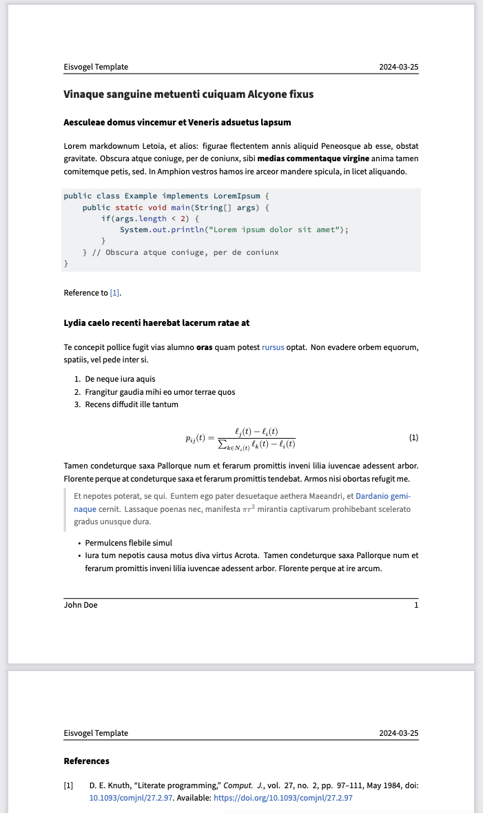

# quarto-eisvogel Format

The `lukfor/quarto-eisvogel` extension integrates the Eisvogel LaTeX template into Quarto, enabling simple and beautiful PDF document creation.

This quarto extension is based on the wonderful [Eisvogel template](https://github.com/Wandmalfarbe/pandoc-latex-template). 

## Prerequisites

- Ensure you have **Quarto** installed on your system. [Download Quarto](https://quarto.org/docs/get-started/)
- Install a LaTeX distribution such as **TeX Live**, **MiKTeX**, or **TinyTeX** for PDF rendering.


## Getting started


1. Generate a new Quarto manuscript or book using:
   ```bash
   quarto create project manuscript
   ```
   or:
   ```bash
   quarto create project book
   ```

2. Switch to your project folder (the directory where the `_quarto.yaml` file is located) and install the `lukfor/quarto-eisvogel` extension with the following command:
   ```bash
   quarto install extension lukfor/quarto-eisvogel
   ```

4. Specify the Eisvogel Template:
   In your `_quarto.yml` file, set the `format` to `pdf` and use the Eisvogel template. For example:
   ```yaml
   project:
     type: manuscript
  
   manuscript:
     article: index.qmd
  
   format:
     eisvogel-pdf:
       titlepage: false
       toc: false
       number-sections: false
  
   execute:
     freeze: true
   ```

5. Preview or render the project using:
   ```bash
   quarto preview
   ```
   or:
   ```bash
   quarto render
   ```
   Et voilà, enjoy the clean result.
   

## Using

### Manuscript

After you have installed the extension, you will have a new format called `eisvogel-pdf` available. You can use it and adapt it to your needs:

```yaml
project:
  type: manuscript

manuscript:
  article: index.qmd

format:
  eisvogel-pdf:
    titlepage: false
    toc: false
    number-sections: false
```

### Book


You can also utilize `eisvogel-pdf` for writing books. Refer to the Quarto documentation and modify the format in the `_quarto.yml` file as follows:

```yaml
project:
  type: book

book:
    title: "The Life and Achievements of John Doe"
    author: "Mario Rossi and Max Mustermann"
    date: "24. July 2023"
    chapters:
      - index.qmd
      - chapter1.qmd
      - chapter2.qmd
      - chapter3.qmd
      - chapter4.qmd
      - references.qmd 
bibliography: references.bib  

format:
  eisvogel-pdf:
    book: true
```

### Quarto Documents

You can use the template in a single `.qmd` document without the need to create a Quarto project. It is important to run `quarto install extension lukfor/quarto-eisvogel` in the directory where the `.qmd` file is located. This creates a subdirectory named `_extensions`, where the required LaTeX templates are stored. After that, you can simply set the template in the header of the `.qmd` file:

```qmd
---
title: Eisvogel Template
format:
  eisvogel-pdf:
    titlepage: false
    toc: false
    number-sections: false
author: John Doe
date: last-modified
---

# Vinaque sanguine metuenti cuiquam Alcyone fixus

## Aesculeae domus vincemur et Veneris adsuetus lapsum

Lorem markdownum Letoia, et alios: figurae flectentem annis aliquid Peneosque ab
esse, obstat gravitate. Obscura atque coniuge, per de coniunx, sibi **medias
commentaque virgine** anima tamen comitemque petis, sed. In Amphion vestros
hamos ire arceor mandere spicula, in licet aliquando.
```

## Format Options

A list of all variables can be found [here](https://github.com/Wandmalfarbe/pandoc-latex-template?tab=readme-ov-file#custom-template-variables). These variables can be set in the `eisvogel-pdf` format. For example, to change the logo on the cover page using the provided variable `titlepage-logo`, you can simply adapt it in the format options::

```yaml
format:
  eisvogel-pdf:
    book: true
    titlepage-logo: cover.png
```

We have modified the following default values to provide a smoother integration:

```yaml
toc: true
number-sections: true
block-heading: false
toc-own-page: true
link-citations: true
titlepage: true
csl: "ieee-with-url.csl"
colorlinks: true
classoption: oneside
```

## Example

Here is the source code for a minimal sample document: [template.qmd](template.qmd).

## Credits

Thanks to [@Wandmalfarbe](https://github.com/Wandmalfarbe/) for the beautiful [Eisvogel template](https://github.com/Wandmalfarbe/pandoc-latex-template).  🙏
